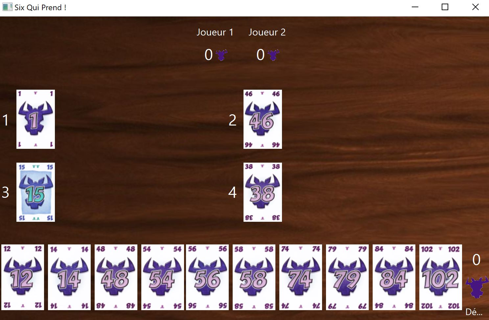
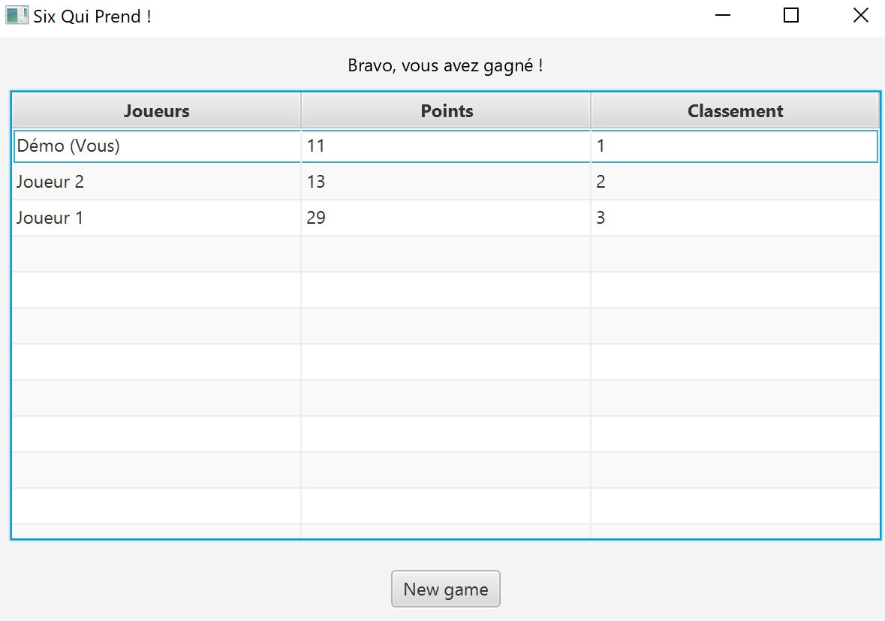

# Adaptation du jeu Six Qui Prend
## Contexte
Ce projet a pour but de réaliser une adaptation du jeu de société
_Six Qui Prend_ en Java en collaboration avec
[marieda92](https://github.com/marieda92).  
Amusez vous avec cette version numérique du jeu !

## Implémentation
### Lancement du jeu
Lorsque vous lancez votre code, une fenêtre s'ouvre. Elle
s'accompagne d'une musique d'ambiance qui permet au 
joueur de vivre une expérience plus immersive.
Pour lancer une partie, il faut alors entrer son nom
et sélectionner le nombre d'IA qu'on souhaite affronter
(nombre allant de 1 à 9)
Il ne reste ensuite plus qu'à cliquer sur le bouton
_Start Game_ afin de débuter la première manche.


## Rappel des règles
Vous accédez ensuite à une page qui vous rappelle les
règles et le but du jeu.
Le jeu est composé de cartes numérotées de 1 à 104, chacune
valant plus ou moins de têtes de boeufs en fonction de sa
valeur.   
Chaque joueur possède dix cartes et une manche se termine
lorsque les joueurs ont joué l'entièreté leur main. Une partie
se termine lorsque le joueur décide de ne pas poursuivre le
jeu avec une nouvelle manche ou lorsqu'une des joueurs
atteint 66 têtes de boeufs.


Le jeu consiste à être le joueur qui a le moins de
têtes de boeufs en fin de partie et est composé
de 4 règles :
* __Valeurs croissantes__ : Les cartes d'une série doivent
  toujours se succéder dans l'odre croissant de leurs valeurs ;
* __Plus petite différence__ : Une carte doit toujours être
  déposée dans la série où la différence entre la
  dernière carte déposée et la nouvelle est la plus faible ;
* __Série terminée__ : Une série est terminée lorsqu’elle
  compte 5 cartes. Lorsqu'une sixième carte doit y
  être déposée, le joueur qui joue cette carte doit
  ramasser les 5 cartes de la série. Sa sixième carte
  forme alors le début d’une nouvelle série ;
* __Carte la plus faible__ : Le joueur qui joue une
  carte si faible qu’elle ne peut aller dans aucune
  des séries doit ramasser toutes les cartes d’une
  série de son choix. Sa carte "faible" représente
  alors la première carte d’une nouvelle série.


## Déroulement du jeu
### Plateau de jeu
Le plateau du jeu se constitue tel que visible sur l'image ci-après.



En bas de l'écran, on peut voir les cartes constituant la
main du joueur et à droite son nombre de têtes de boeufs.  
Au centre, on distingue les quatre rangées de cartes
numérotées avec la carte initiale.
En haut de l'écran, on aperçoit les IAs et leur nombre de
têtes de boeufs respectifs.

### Tour d'un joueur
Un joueur joue son tour en sélectionnant la carte qu'il
souhaite ajouter au plateau. Pour se faire, il suffit de
cliquer sur la carte voulue.  
Une comparaison des cartes jouées par tous les joueurs
est alors réalisée. On place les cartes dans l'ordre
croissant en respectant les règles citées dans la section
ci-dessus.


Dans l'exemple ci-dessus, le joueur a joué la carte 48 et
les deux IAs ont joué les cartes 16 et 40. La carte 16
est donc placée en première, puis la 40 et enfin la 48.  
Les cartes se placent toute seule sur le plateau lorsque
le joueur en sélectionne une.

### Carte la plus faible
La règle de la carte la plus faible impose de récupérer
une rangée lorsque la carte choisie est plus faible que
celles sur le plateau. Dans le cas ci-dessous,le joueur
décide de jouer la carte 12. 


Le joueur est invité à choisir la rangée qu'il souhaite
prendre parmi les quatre disponibles grâce à un pop-up
contenant un menu déroulant :


Les têtes de boeufs sont alors additionnées à ses points
et sa carte remplace la rangée sélectionnée. Dans le cas
présent, le joueur a sélectionné la rangée 1 et a donc
récupéré 2 point, ceux des cartes 1 et 14.


### Série terminée
Lorsque le joueur doit placer sa carte en tant que sixième
carte d'une rangée, la règle des séries terminées
s'applique. Alors les points de la rangée s'additionne à
ses points. 
Dans le cas ci-dessous, la rangée numéro 2 est composée 
de 5 cartes. 


L'IA 2 joue le 45 qui est placée dans la rangée 4.
Ensuite, la carte à jouer est celle de l'IA 1 qui a 
sélectionné le 55. Il récupère donc la rangée 2, qui 
comptabilise 7 têtes de boeufs. Enfin, le joueur joue le
56 qui est placée derrière le 55 dans la rangée 2.


### IA
Les Ia doivent sélectionner une carte à jouer à chaque tour.
Pour ce faire, elle évalue chaque carte de sa main en lui
attribuant un score et choisit la carte dont le score est
le plus élevé. 
 ``` java
public Card aiPlays(AiPlayer ai) {
    int size = ai.getHand().size();
    ArrayList<Integer> evaluation = new ArrayList<>();
    for (int i=0;i<size; i++) {
      Card card = ai.getHand().get(i);
      evaluation.add(evaluateCard(card));
    }
    int index = evaluation.indexOf(Collections.max(evaluation));
    Card cardToPlay = ai.getHand().get(index);
    ai.getHand().remove(cardToPlay);
    return cardToPlay;
}
 ```

La carte est évaluée selon plusieurs critères. Plus la 
carte est proche d'une des dernières cartes des rangées,
plus elle obtient de point.  
De même, le nombre de point obtenu diminu lorsque la rangée
est proche d'atteindre 5 cartes. 
Ainsi, l'IA essaie de minimiser ses chances de récupérer 
une rangée. 

 ``` java
    public int evaluateCard(Card card) {
        int value = 0;
        int indexSerie = card.getMinimumStack(this.stacks);
        if (indexSerie<0){
            value = - (10 + card.getNumber());
        } else {
            Serie serie = stacks.get(indexSerie);
            int difference = card.getNumber() - serie.getLastCard().getNumber();
            int stackSize = serie.getStack().size();
            if (difference == 1) {
                value = 100;
            } else if (difference <5) {
                value = switch (stackSize) {
                    case 1 -> 95;
                    case 2 -> 90;
                    case 3 -> 80;
                    case 4 -> 70;
                    default -> value;
                };
            } else if (difference < 15) {
                value = switch (stackSize) {
                    case 1 -> 90;
                    case 2 -> 80;
                    case 3 -> 70;
                    case 4 -> 55;
                    default -> value;
                };
            } else if (difference < 30) {
                value = switch (stackSize) {
                    case 1 -> 80;
                    case 2 -> 70;
                    case 3 -> 60;
                    case 4 -> 40;
                    default -> value;
                };
            } else if (difference < 50) {
                value = switch (stackSize) {
                    case 1 -> 60;
                    case 2 -> 50;
                    case 3 -> 30;
                    case 4 -> 15;
                    default -> value;
                };
            } else if (difference < 70) {
                value = switch (stackSize) {
                    case 1 -> 20;
                    case 2 -> 10;
                    case 3, 4 -> 40;
                    default -> value;
                };
            } else {
                value = switch (stackSize) {
                    case 1 -> 0;
                    case 2 -> 10;
                    case 3, 4 -> 70;
                    default -> value;
                };
            }
        }
        return value;
    }
 ```

### Fin de manche
Lorsque toutes les cartes des joueurs ont été jouées, deux 
possibilités s'offrent au joueur humain. Il peut continuer
à jouer en procédant à une autre manche - et attendre 
qu'un des joueurs atteigne 66 têtes de boeufs - ou 
décider d'arrêter de jouer et d'accéder au tableau des 
scores. Si le joueur décide de continuer la partie, il débute
la nouvelle manche en conservant les têtes de boeufs
amassées à la manche précédente.
Le choix est proposé au joueur grâce à 
un pop-up. 


### Tableau des scores
Lorsque le jeu se termine - lorsque le joueur humain a 
décidé de ne pas procéder à une nouvelle manche ou
lorsqu'un joueur a atteint 66 têtes de boeufs - le tableau
des scores s'affiche.  
Ce tableau classe les joueurs en fonction de leurs nombres
de têtes de boeufs à la fin de la dernière manche. 



